# Azure deploy methodology 

* Create an account on [Azure](https://login.microsoftonline.com/organizations/oauth2/v2.0/authorize?redirect_uri=https%3A%2F%2Fportal.azure.com%2Fsignin%2Findex%2F&response_type=code%20id_token&scope=https%3A%2F%2Fmanagement.core.windows.net%2F%2Fuser_impersonation%20openid%20email%20profile&state=OpenIdConnect.AuthenticationProperties%3Dib6zjcPV4Q__DKPSxapDEXrlQzE87Fwb8qbLPmr9e2gzttmmkao2KsT0OhizaNRXNVkRoU0kG6AI7ZhDfw3mgDYpomOhIajUCWVG0tDquG5noHxfDwQZYYxJausIZVcvmajGzWhU1lTWtkNu87wPSYQxi32SeTd69vNcXoEcwUwr2IHMq4UPhBeAMAJ3gtsU1l6tkmR0ksl1Y-LuDt5Lf-m6W3OQQGi4wzWSY_qOOQeeq4KOTJ1r3_-qC4yYpOR1KdvGhDsFXy0VrTG0NwbuJtipz4Rx9VvazLHQgaUQvaGT3X5OEi4ZHBo15qDcfhjlEnBQL0R5ZMO72dKD-icdw5GUd3gRNxFFZ2D8AEQ3-4Gq1e6b_f7yklnYqYxxAmnH_wBZ-kGIGjtrTlWGfoOIOixPXiUwqs1HZWYV4S2gVvluGT3Lfx2DmuR8zxsM5scjGaei_QqW0Zbxk9yeKKmIHetuzlXYZbhAFvlk9E-9hPE&response_mode=form_post&nonce=638129340507013579.NGY5ZTMwMDAtNWZiYS00NzU3LWJhNDgtZGMzZmNhMjAyNTM2ZDE3YjY5MTMtMjUzNS00ZGVkLTkwMjctNjk5M2E1ZDg2YWU3&client_id=c44b4083-3bb0-49c1-b47d-974e53cbdf3c&site_id=501430&client-request-id=30ead709-9225-4dd5-94aa-843ef3ad1adb&x-client-SKU=ID_NET472&x-client-ver=6.22.1.0)
* Create a resource group [Resource group](https://portal.azure.com/#create/Microsoft.ResourceGroup)
* Create the [App Service](https://portal.azure.com/#create/Microsoft.WebSite) with those settings :
subscription: the subscription created with user account
resource group: the name of the previously created resource group

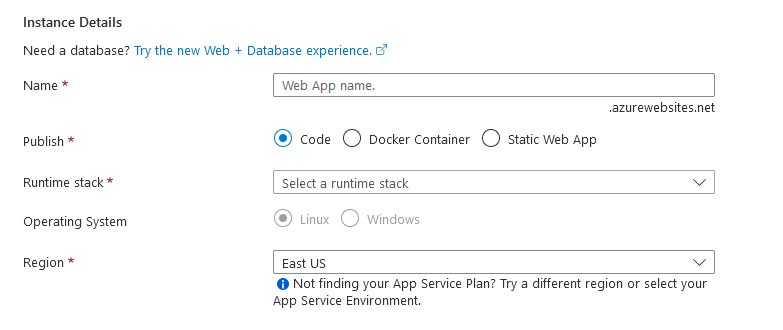
* Set up a name to your web app 
publish: code
runtime stack: nodejs 18
OS: Linux (IMPORTANT)
Region: West Europe

* Go to 
[Azure dev portal](https://dev.azure.com/haidi-saas/)
* Create an organisation
* In your organisation, click on 

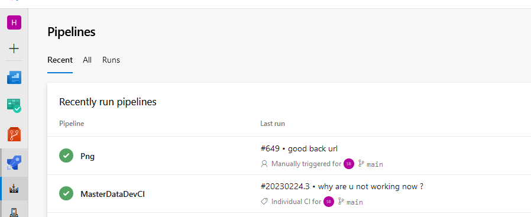
* Click on New Pipeline on top right of the screen
* Click on Get sources and link you github repository, or create a Azure devops repository
* Click on the "+" next to Agent Job 1 (you can rename it later)
* App 2 npm tasks, a copy file task, an archive task, and a publish task 

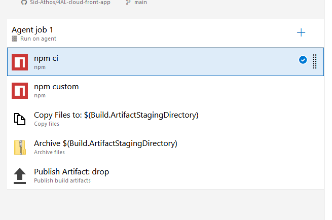
* First npm task is NPM CI, don't forget to set the working directory if your repo has nested directories
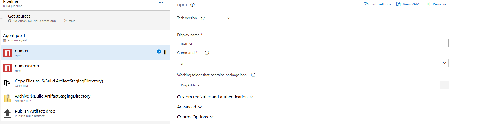
* Second npm task is NPM RUN BUILD, set the command as custom in the task, same thing for working directory
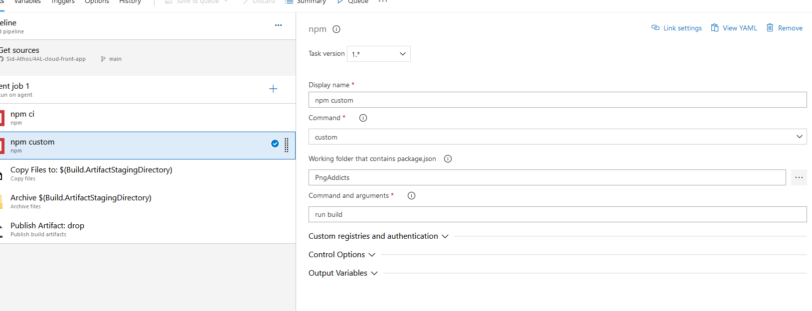
* The copy file task copies the dist/build content to the artifact staging directory
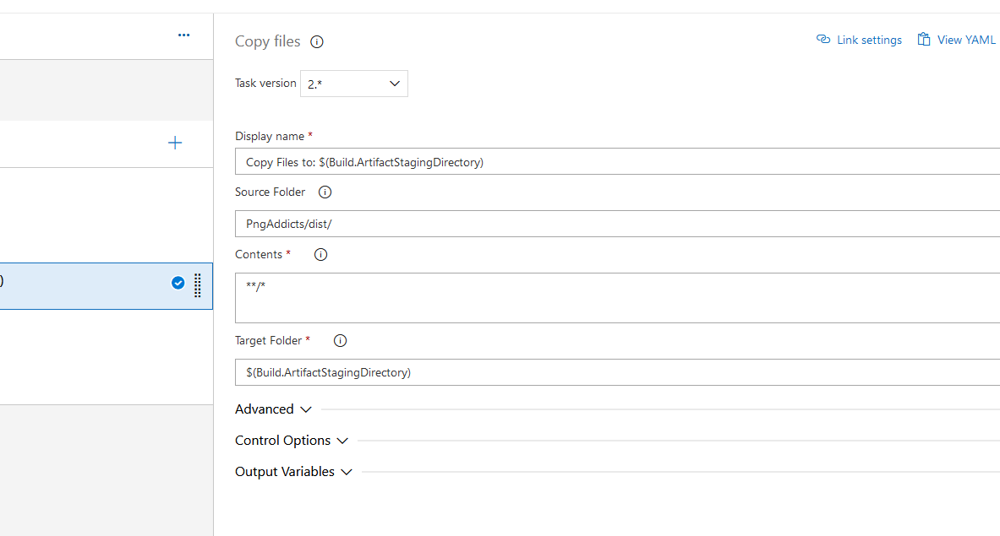
* The archive task creates a zip for faster upload of the dist folder copied previously
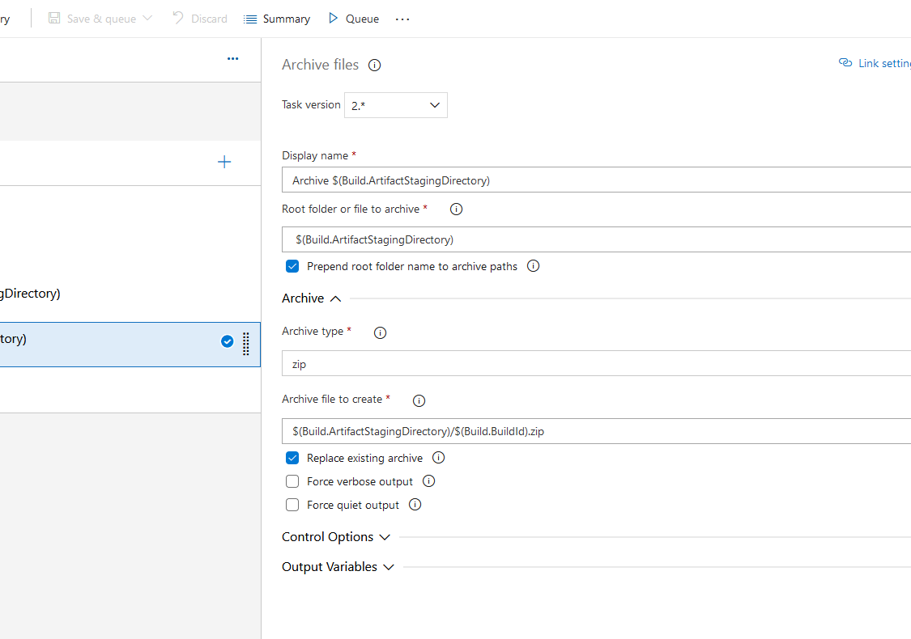
* The publish task makes the artifact available for deploys/releases
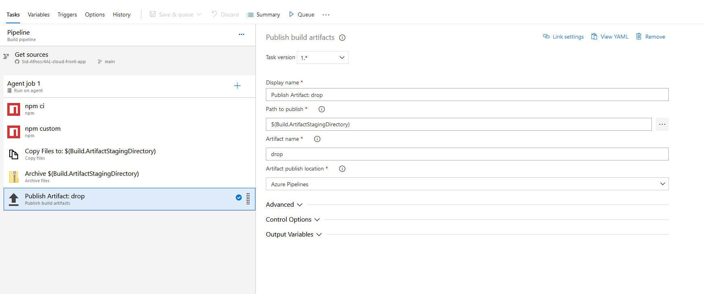
* You can enable continuous integration in the triggers tab
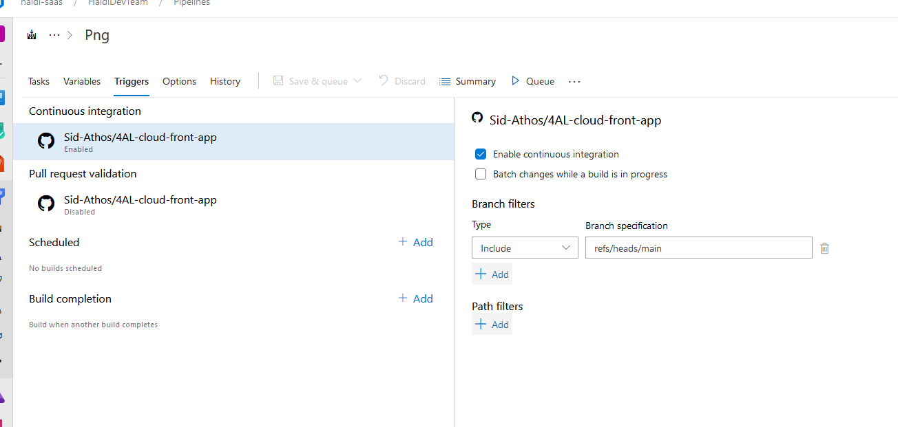
* Save and queue the job.
* Your screen should look like this
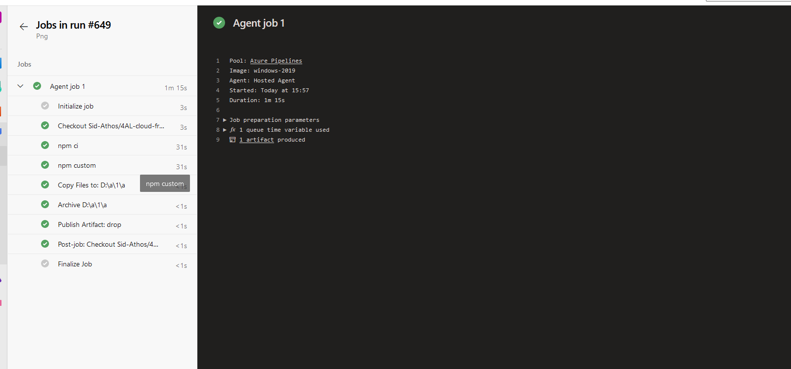

* Last step is setting up the deploy of the app

* In the pipeline tab on left menu, click on Releases

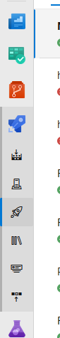
* Create a new release pipeline

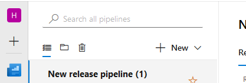
* Start it with an empty job
* In the artifacts, add the source. The source is the result of previously published zip

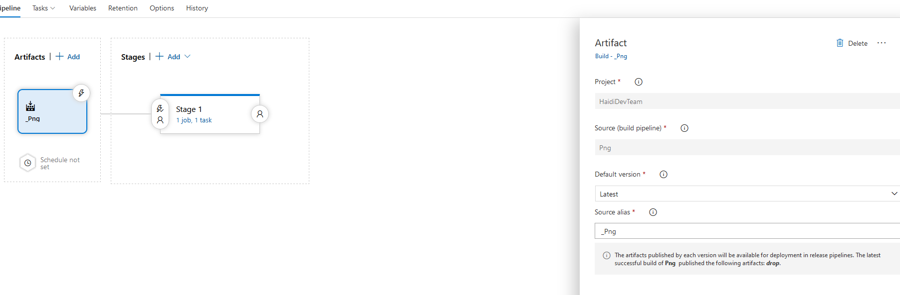
* on the first stage, click on the "1 job, 0 task" link

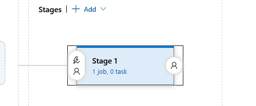
* Click on the "+" next to agent job
* Search for "Azure Web App"
* Select your subscription, put "Web App on linux" as app type, select the web app you created in app name
* Put node18 as runtime stack
* Add "pm2 serve /home/site/wwwroot --no-daemon --spa" as the startup command
* Your pipeline should look like this :

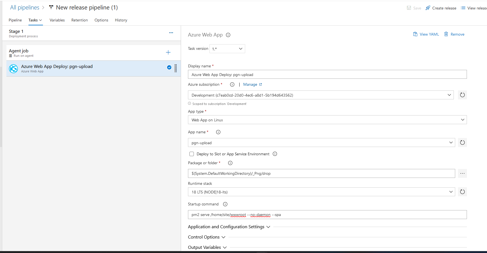
* Save and Create the release
* Your screen should look like this
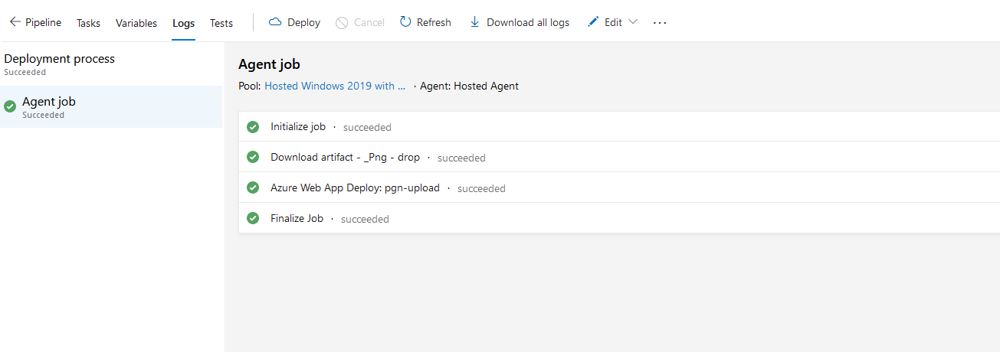
* Go to the Azure Web App Deploy step
* Control click on application url
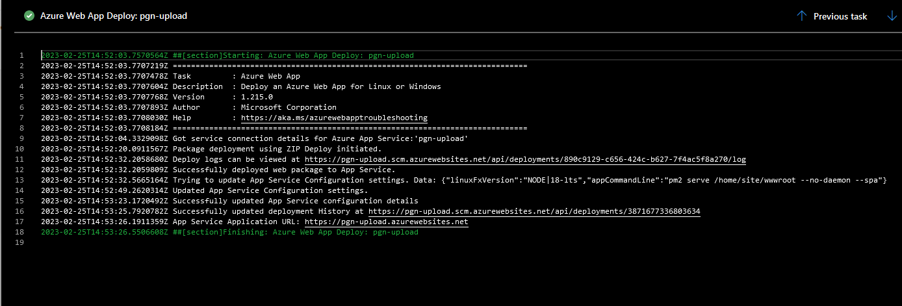

# Congratulations, you deployed your first react app using Azure

